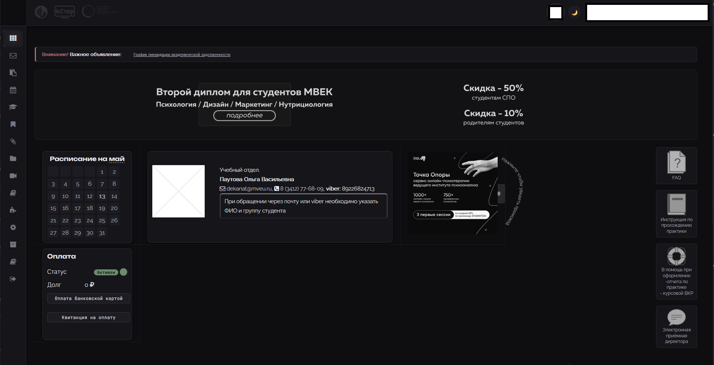

# 🌑 InStudy / disto.mveu.ru — Mono UI

Tampermonkey-скрипт — полный UI-оверхаул студенческого портала [disto.mveu.ru](https://disto.mveu.ru) (InStudy, МВЕУ): монохромная палитра, переработанная вёрстка, оптимизация производительности.



## ⚙️ Установка

1. Установите расширение [Tampermonkey](https://www.tampermonkey.net/) для вашего браузера.
2. Откройте **Tampermonkey → Настройки → Утилиты → Импорт из URL** и вставьте ссылку:
   ```
   https://raw.githubusercontent.com/juushimatsu/instudy-mveu-ui-fix-tampermonkey/main/main.js
   ```

## ✨ Возможности

- **Тёмная + светлая монохромная тема** — переключение кнопкой в шапке, выбор сохраняется в `localStorage`
- **Переработанное боковое меню** — узкая рейка 68 px, раскрывается по hover до 280 px с анимацией
- **Шрифты** — JetBrains Mono (UI / моноширинный) + Unbounded (заголовки)
- **Фиксы вёрстки** — шапка (`#status_bar`), форма входа, чат (стиль мессенджера, разделение «свои / чужие»), CRUD-таблицы, бейджи, аватары
- **Lazy-load списка преподавателей** — `.gulist` подгружается порциями по 60 при скролле + `content-visibility: auto`
- **Авто-фолбек аватаров** — сломанные `` заменяются на инициал в круге
- **Отключение цветовых тем портала** — `blue.css` / `pink.css` деактивируются, inline-стили белого фона перебиваются
- **MutationObserver** — все правки применяются и к AJAX-контенту

## 🌐 Совместимость

| Браузер | Поддержка |
|---------|-----------|
| Chrome  | ✅        |
| Firefox | ✅        |
| Edge    | ✅        |

Требуется расширение **Tampermonkey**.

## 📝 Лицензия

[Apache License 2.0](LICENSE)
